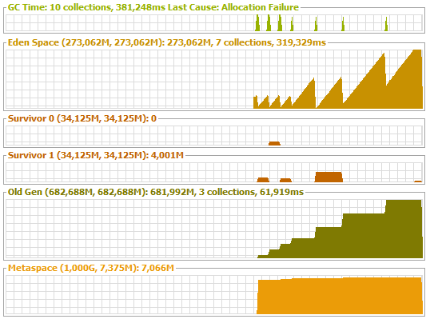
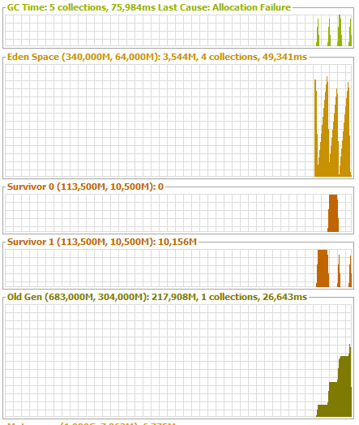
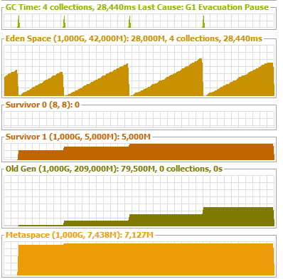

# jit: -XX:+PrintCompilation
В jit1_out.txt лежит вывод всей программы, самое важное что можно от туда выцепить:
```
     38   53       3       java.util.HashMap::put (13 bytes)
////////////////////////////jit task begin////////////////////////////
     59  130       3       java.lang.Integer::valueOf (32 bytes)
     59  132       3       java.lang.Integer::hashCode (8 bytes)
     59  133       3       java.lang.Integer::hashCode (2 bytes)
     71  150       4       java.util.HashMap::put (13 bytes)
     72  152       4       java.lang.StringConcatHelper::prepend (37 bytes)
     73  123       3       java.lang.StringConcatHelper::prepend (37 bytes)   made not entrant
     73  153       4       java.lang.StringConcatHelper::newArray (40 bytes)
     74  124       3       java.lang.StringConcatHelper::newArray (40 bytes)   made not entrant
     74  156       4       java.lang.StringConcatHelper::newString (67 bytes)
     75  125       3       java.lang.StringConcatHelper::newString (67 bytes)   made not entrant
     75  158       4       java.lang.Integer::valueOf (32 bytes)
     76  130       3       java.lang.Integer::valueOf (32 bytes)   made not entrant
     76  159       4       java.lang.Integer::hashCode (8 bytes)
     76  132       3       java.lang.Integer::hashCode (8 bytes)   made not entrant
     79   53       3       java.util.HashMap::put (13 bytes)   made not entrant
////////////////////////////jit task end//////////////////////////// 
```
Пока мы выполняли jit task у нас скомпилировались в четвертый тир: методы конкатенации строки, Integer::valueOf, HashMap::put, Integer::hashCode.

# jit: -XX:+PrintCompilation -XX:+UnlockDiagnosticVMOptions -XX:+PrintInlining
В jit2_out.txt лежит вывод всей программы, к информации о компиляции добавилась информация о инлайне методов - метод который пытаемся заинлайнить, результат. Инлайн производится каскадно, то есть и для методов вызываемых в методе который мы инлайним
```
@ 1   java.lang.String::length (11 bytes)   inline
@ 3   jdk.internal.misc.Unsafe::getReferenceVolatile (0 bytes)   intrinsic
@ 17   java.lang.IllegalArgumentException::<init> (6 bytes)   don't inline Throwable constructors
@ 43   jdk.internal.org.objectweb.asm.ByteVector::enlarge (73 bytes)   callee is too large
@ 40   java.lang.StringLatin1::inflate (10 bytes)   callee uses too much stack
@ 123   java.util.HashMap$TreeNode::putTreeVal (314 bytes)   callee's klass not linked yet
@ 203   java.lang.Object::equals (11 bytes)   no static binding
@ 1   java.lang.Object::<init> (1 bytes)   inline (hot)
@ 203   java.lang.Object::equals (11 bytes)   virtual call
```
Самые распостраненные результаты:
 - inline - инлайн произведен успешно
 - intrinsic - метод реализован в jvm
 - don't inline Throwable constructors - в метод не был заинлайнен конструктор исключения
 - callee is too large - байт код метода слишком большой
 - callee uses too much stack - методу пнадобиться больше стека чем ему можно дать
 - callee's klass not linked yet - класс вызываемого метода еще не слинкован
 - no static binding - вызов метода не может быть разрешен на этапе компиляции и будет выполнен в рантайме
 - (hot) - горячий код(вызывается часто)
 - virtual call - нужный оверрайд метода будет извесен в рантайме

# garbage collector: -XX:+UseSerialGC



# garbage collector: -XX:+UseParallelGC



# garbage collector: -XX:+UseG1GC


